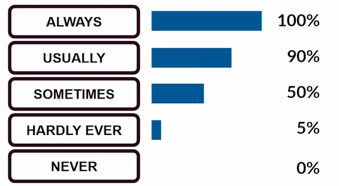

# Quantities and gerunds

[quantities--and-gerunds-slides.pdf](https://static.platzi.com/media/public/uploads/basic_english_course_a2_quantities-_and_gerunds_slides_c2e5e239-b9cc-46b1-8239-9cedad9c9555.pdf)

## Superlatives using most and est

**Los superlativos son palabras que describen una cualidad en su máximo o mínimo punto.** Veámoslo con algunos ejemplos:

Los superlativos se separan en 4 categorías principales:

| Una sílaba                                                   | Dos sílabas                                                  | Tres o más sílabas                                           | Irregulares                                                  |
| ------------------------------------------------------------ | ------------------------------------------------------------ | ------------------------------------------------------------ | ------------------------------------------------------------ |
| big = big**gest**                                            | happy = happiest                                             | beautiful = the most beautiful                               | the best                                                     |
| nice = nice**st**                                            | simple = the most simple                                     | expensive = the most expensive                               | the worst                                                    |
| Si la palabra termina en consonante, se repite y agrega **est**. Si termina en vocal, sólo se agrega **st**. | Cuando termina en “y”, la cambiamos por “i” y agregamos est. | Para superlativos de tres sílabas siempre vamos a usar “artículo + superlativo”, ya que son palabras muy largas. | Estos casos escapan de la regla y debemos tomarlos en cuenta para usarlos bien. |

**Nota**: Podemos crear superlativos de dos sílabas con “the most” o agregando “st”. Ejemplo:

- The most simple exercise in the class.
- The simplest exercise in the class.

### Cómo crear oraciones con superlativos

La forma de componer oraciones con superlativos es la siguiente:

> **Artículo + superlativo + adjetivo + sustantivo**

Ejemplos:

- The blue whale is **the biggest animal** in the world.
- This is **the most expensive ring** I have.
- Sam is **the happiest kid** I know.
- This is **the best book** I have read.

> Three types:
>
> 1. **One Syllable:** The biggest, the nicest.
> 2. **Two syllables:** The happiest, the most simple / simplest
> 3. **Three or more syllables:** The most beautiful, the most expensive.
> 4. **Irregular:** The best, the worst.
>
> **Practice:**
>
> 1. The blue whale is **the biggest** animal in the world.
> 2. This is **the most expensive** ring I have.
> 3. Sam is **the happiest** kid I know.
> 4. This is **the best** book I have read.
>
> **Homework:**
>
> 1. Karl, that’s the biggest lie I’ve ever heard.
> 2. I’ll buy the smallest iPhone because they tend to be cheaper.
> 3. Everyone knows Mary is the tallest in the class.
> 4. Flash is the fastest character in the D.C. universe.
> 5. Sometimes I feel like I’m living in the hottest city in Peru.
> 6. We can’t travel by bus again, I think that was the slowest bus I’ve ever experienced.
> 7. Which is the strongest, Batman or Superman?
> 8. When you look at an MMA fight, the weakest contender sometimes wins.
> 9. Lucy is the sweetest person I’ve ever known.
> 10. Steve Vai is the best guitar player.

## How to form superlative adjectives

**Superlative Adjectives**

THE + SUPERLATIVE ADJECTIVE + NOUN

One and two syllables

- General rule: add ***-est***

| Adjective | Superlative |
| --------- | ----------- |
| tall      | the tallest |
| long      | the longest |

Examples:

1. Sarah is **the tallest girl** in our classroom.
2. Titanic is **the longest movie** I have ever seen.

- If the adjective **ends in e**, add ***-st***

| Adjective | Superlative |
| --------- | ----------- |
| nice      | the nicest  |
| large     | the largest |

Examples:

1. Martha is **the nicest person** I know.
2. Brazil is **the largest country** in South America.

- If the adjective **ends in CVC (consonant + single vowel + consonant)**, we double the final consonant and add ***-est\***

| Adjective | Superlative |
| --------- | ----------- |
| big       | the biggest |
| sad       | the saddest |

Examples:

1. What is **the biggest animal** in the world?
2. “Tears in heaven” is **the saddest song** I can remember.

- If the adjective **ends in consonant + y**, change the *y* to an *i* and add ***-est***

| Adjective | Superlative  |
| --------- | ------------ |
| happy     | the happiest |
| busy      | the busiest  |

Examples:

1. My wedding day was **the happiest day** of my life!
2. Johnny is **the busiest person** at the office.

Two and three or more syllables

- Put **most** in front of the adjective

| Adjective | Superlative        |
| --------- | ------------------ |
| beautiful | the most beautiful |
| perfect   | the most perfect   |
| expensive | the most expensive |

Examples:

1. My daughter is **the most beautiful baby** ever.
2. That’s **the most perfect artwork** I have seen.
3. We can’t fly first class. Those are **the most expensive tickets**.

**List of two-syllable adjectives you can either add -est or put most in front**

- common
- narrow
- cruel
- pleasant
- gentle
- polite
- handsome
- simple
- likely
- stupid

Examples:

1. This is **the most simple way** to explain the exercise.
2. This is **the simplest way** to explain the exercise.
3. Let’s ask Martin to speak to the principal. He is **the most polite person** here.
4. Let’s ask Martin to speak to the principal. He is **the politest person** here.

**Irregular superlatives**

| Adjective | Superlative                 |
| --------- | --------------------------- |
| bad       | the worst                   |
| far       | the farthest / the furthest |
| good      | the best                    |
| little    | the least                   |
| much      | the most                    |

Examples:

1. My grandma bakes **the best cookies**.
2. Nothing works! This is **the worst system** I’ve ever worked with.

## Interactive quiz

Vamos a poner en práctica el uso de superlativos usando most y +est. En el siguiente **ejercicio**, completaremos cada una de las palabras con las opciones **del superlativo** que creamos correcto:

1. beautiful: _______________

- The -est.
- The most.
- Both.

1. big: _______________

- The -est.
- The most.
- Both.

1. tall: _______________

- The -est.
- The most.
- Both.

1. perfect: _______________

- The -est.
- The most.
- Both.

1. pleasant: _______________

- The -est.
- The most.
- Both.

1. simple: _______________

- The -est.
- The most.
- Both.

1. expensive: _______________

- The -est.
- The most.
- Both.

1. happy: _______________

- The -est.
- The most.
- Both.

1. nice: _______________

- The -est.
- The most.
- Both.

1. handsome: _______________

- The -est.
- The most.
- Both.

------

**Respuestas**:

- The most beautiful.
- The biggest.
- The tallest.
- The most perfect.
- The most pleasant / The pleasantest
- The most simple / The simplest
- The most expensive.
- The happiest.
- The nicest.
- The most handsome / The handsomest

## the most wonderful place I've visited

> ## Diálogo usando superlativos
>
> **Guest**: Hey, Cesar! How are you? Welcome back to the office! What about your vacations? Tell me everything.
>
> **Cesar**: Hi Jhon! Everything is great, especially after all these days of resting! The vacations were super cool! I dare to say those were the best vacations of my life!
>
> **Guest**: Really?! Where did you go?
>
> **Cesar**: I went on a cruise with my family. We traveled to different places there.
>
> **Guest**: That’s so nice! So tell me, what was the most beautiful view you saw?
>
> **Cesar**: It was actually when I was in the middle of the ocean. Seeing the sunset from the ship was, for sure, one of the most amazing views I have ever seen.
>
> **Guest**: Wow! I can imagine, Cesar. And what about the food?
>
> **Cesar**: Aaaaah, the food! So good! I could try dishes from different places, but the most delicious was the seafood. We were in the Caribbean, so I ate lots of seafood.
>
> **Guest**: I really enjoy the food when I’m in a hotel, but for me, the coolest part is spending time by the pool. Just to tan. You know I’m the worst swimmer, right? hahaha.
>
> **Cesar**: You would have loved the pools there. There were three of them, and the nicest one was located on the highest floor! You could tan admiring the horizon.
>
> **Guest**: Oh! No way! I’m afraid of heights. I can’t feel safe! That’s the worst feeling for me. To be honest, I don’t know if I would ever go on a cruise. Imagine if something happens in the middle of the ocean.
>
> **Cesar**: No worries about that. I believe the crew members are the most trained people in the world. One of them told me they do drills every week, and in case of an emergency, the safest thing to do is to
> follow their instructions.
>
> **Guest**: That’s true! But Cesar, tell me more! What else is there to do on a cruise ship?
>
> **Cesar**: There are many live concerts every night. But you know I like dancing, so the best entertainment for me was the dance productions. I felt like watching a Broadway play. The most spectacular dancers
> and the most beautiful light effects.
>
> **Guest**: Really? And what about your family? What were their favorite things to do?
>
> **Cesar**: My mom and dad spent half of the time at the casino. For them, that was the most fun thing to do. My sister liked to participate in the trivia nights. She was the fastest at answering the questions.
>
> **Guest**: I didn’t know there were so many things to do on a cruise. I’m starting to change my mind.
>
> **Cesar**: And you should! It was the most exciting trip I’ve ever had!
>
> **Guest**: I’m glad to hear that! And I’m glad you are back to work. We missed you here.
>
> ------
>
> **Respuestas:**
>
> - The best vacation
> - The most beautiful.
> - The most amazing.
> - The most delicious.
> - The coolest.
> - The nicest.
> - The most trained.
> - The best entertainment.
> - The most spectacular.
> - The most beautiful.
> - The most fun.
> - The fastest.
> - The most exciting.

[class-5-roleplay--the-most-wonderful-place-i-ve-visted-script.docx](https://static.platzi.com/media/public/uploads/class-5-roleplay_-the-most-wonderful-place-i_ve-visted-script_7464d33a-8ad1-48e7-8961-72f78857e6ca.docx)

## Countable and uncountable nouns

### Los uncountable nouns no llevan artículo

En el inglés, hay veces en las que no necesitamos usar artículos (the, a, an) para acompañar a los sustantivos. Especialmente, cuando los sustantivos son incontables. No decimos *I need a love,* sino *I need love*, ya que el amor no se puede medir en cantidad.

### Ejemplos de oraciones con uncountable nouns

Fíjate en la ausencia del artículo.

- I’d like to drink iced tea. / Me gustaría beber té helado.
- The girl likes to eat ice cream. / A la chica le gusta comer helado.

**Repaso**: Crea tus propias oraciones con *tea* e *ice cream*, sin utilizar artículos.

### Las generalizaciones no llevan artículo

Cuando hablamos de personas, cosas o situaciones de manera general, es decir, sin referirnos a algo en específico, tampoco empleamos artículos.

#### Ejemplos de generalizaciones

Mira que en ninguna de estas oraciones se emplea *the, a* o *an*; es decir, no llevan artículo.

- Life is beautiful. / La vida es hermosa.
- I don’t like homework. / No me gustan las tareas.
- People are kind. / La gente es amable.
- Sunny likes apples, but not oranges. / A Sunny le gustan las manzanas, pero no las naranjas.
- She likes dogs. / A ella le gustan los perros.
- Water is good for your health. / El agua es buena para tu salud.

**OJO**: como podemos observar, en el español, las oraciones sí llevan artículo. Sin embargo, en el inglés no se deben usar, ya que se está generalizando. En el primer ejemplo, *la vida es hermosa*, nos referimos a la vida en general, no a la vida de alguien en específico.

### Ejercicio de oraciones sin artículos

Crea 5 ejemplos de oraciones con sustantivos que no requieran utilizar artículos. Te dejo mis 5 ejemplos si te pueden servir de alguna guía.

- Some apples are green.
- He needs to drink water.
- Andrea eats eggs for breakfast.
- I love pizza.
- Life is strange.

> Coffee is the best!
> I need money!
> There are chairs in the living room.
> Down with homework!
> Maria loves cats.

[Class 6 - Uncountable nouns.pdf - Google Drive](https://drive.google.com/file/d/1OHdTuOPTvzJ2Yw6iLaN7l_zCoHMXm5r2/view?usp=sharing)

## Some / a lot of / lots of

Usamos **some, a lot of y lots of** con sustantivos contables, incontables, así como en oraciones afirmativas, negativas y hasta en preguntas.

### ¿Qué significa Some / a lot of / lots of?

- **Some**: un número o cantidad indeterminada de algo
- **A lot of / lots of**: un gran número o cantidad de algo

### ¿Cuál es la diferencia entre a lot of y lots of?

Afortunadamente, hay una buena noticia: son iguales. Puedes utilizar cualquiera y tendrán el mismo significado. La única diferencia que podemos destacar es que ***lots of\*** es más informal que ***a lot of\***. ***Lots of\*** es como una abreviación que empleas con tus amigos, como I’m y I am.

Veamos algunos ejemplos en que podemos usar cada una:

- I saw **some** police officers in front of your house. / He visto a algunos policías delante de su casa.
- There are **a lot of** / **lots of** people here. / Hay mucha gente aquí.
- Would you like **some** coffee? / ¿Te gustaría algo de café?
- I didn’t have** a lot of / lots of** time to finish the exam. / No tuve mucho tiempo para terminar el examen.
- He drinks **a lot of / lots of** water. / El bebe mucha agua.
- He is drinking **some** water. / Él está bebiendo un poco de agua.

#### Ejercicio:

Crea al menos 3 oraciones usando cada una de las palabras aprendidas en esta clase. Te comparto unos ejemplos más que puedes usar como guía:

- I have finished my classes. I have** a lot of** time.
- I have **some** iced tea in the fridge.
- I want **a lot of** cheese on my pizza.
- I need **some** money for groceries.

> I’m drinking some coffee.
> We have a lot of books.
> There are some bananas in the fridge.
> There are a lots of dogs in the park.

> - I’ll give you lots of hugs and kisses when I’ll see you. 😃
> - My coworker didn’t come today and I have a lot of work. 😮
> - There are a lot of birds on this tree. 😄
> - Some glasses were broken by the earthquake. 😦
> - Would you like to meet some friends? 😉,

## Nouns with countable and uncountable meanigs

Hay sustantivos incontables que tienen forma plural! Vamos a ver cómo reconocerlos.

### Cómo identificar *uncountable nouns* que pueden estar en plural

La forma plural de uncountable nouns se usa cuando se habla de “**tipos de**” o “**variedades de**” algo. Es por esto que, para identificar si se puede emplear el sustantivo incontable en plural, debes **tener en cuenta el contexto**.

Por ejemplo, tanto el café como el queso existen en distintas variedades. Existe el café espresso, americano, así como que queso cheddar, parmesano, etc.

Sabiendo esto, podemos formular preguntas para referirnos a uno o varios tipos, como:

- *¿Which are the most popular chesses?*
- *¿Which are the best colombian coffees?*

### Ejemplos de sustantivos incontables en plural

En inglés, entre los sustantivos que pueden ser countable y uncountable, encuentras:

- Coffee / Coffees
- Water / waters
- Cheese / cheeses
- Milk / milks
- Bread / breads
- Sugar / sugars
- Oil/ oils

#### Oraciones usando uncountable nouns en plural

- What are the top **10 cheeses**? (types of cheese) / ¿Cuáles son los 10 mejores quesos?

- I’d like **three coffees** to go, please (cups of coffee). / Quiero tres cafés para llevar, por favor.

- What are the **most popular breads** around the world? / ¿Cuáles son los panes más populares del mundo?

- You should mix **different oils** for a better result. / Deberías mezclar diferentes aceites para obtener un mejor resultado.

#### Ejercicio usando sustantivos incontables en plural:

A continuación, piensa en 5 sustantivos que funcionan como contables e incontables y formula oraciones de cada una en las dos formas.

#### Ejemplo usando cheese y cheeses:

**Uncountable noun:** Cheese
**Used in a sentence:** Cheese is yellow.
**Used as a plural noun:** Semi-soft cheese**s** are the best ones.

> > Wine
>
> - I lost my wine last night.
> - Please, recommend me three wines.
>
> > Gasoline
>
> - Gasoline it’s almost over.
> - I want to buy two gasolines.
>
> > Jam
>
> - She found jam in my fridge.
> - OMG, this aisle it’s full of jams

## Quantifiers with of

Un cuantificador (quantifier) es una palabra que indica la cantidad de algo. Generalmente, van acompañadas de la palabra **of**. Algunos de ellos son:

- **lots** / muchos
- **some** / algunos
- **a bit** / un poco
- **a lot** / mucho

### Cómo usar *quantifiers*

Los quantifiers se usan después de sustantivos, pronombres, determinantes o una forma posesiva antes de un sustantivo.

- She donated **lots of her clothes** to charity. // Ella donó mucha de su ropa a la caridad.
  En esta oración podemos saber que ella no donó toda su ropa, pero sí una gran cantidad.

### Ejemplos del uso de *quantifiers*

- **Some of these pens** are not mine.
- You should have **a bit of optimism**.
- **Lots of their money** came from their family.
- **A lot of the umbrellas** are pink.
- Can I have **some of your brownies**, please?
- I save **a bit of money** every month.

> She learned **a lot of his** boyfriend
>
> He paid a lot **of money** yesterday
>
> He saved some **of his candy** in my backpack
>
> I spent a bit **of my** money
>
> A lot **of students** prefer to learn face-to-face
>
> ----
>
> I love lots of the shoes.
> She has some oranges.
> I want a bit of rice.
> I still don’t know a lot of Acapulco beaches.

## Using quantifiers at the spermarket

Vamos a poner en práctica el uso de *countable & uncountable nouns* y *quantifiers* en el siguiente diálogo. Presta mucha atención a la conversación que están teniendo César y su mamá.

Al final, tendrás que responder a tres preguntas:

1. What are they going to buy at the supermarket?
2. How many wines do they have?
3. Why are they not buying soda?

> 

**Cesar’s phone rings**

**Cesar**: Hello.

**Mom**: Hi, darling. It’s mom!

**Cesar**: Hey mom. Is everything ok?

**Mom**: Yeah, all good. I’m calling to ask you to go to the supermarket with me after work. Aunt Josy is coming for lunch tomorrow, and we need food! Lots of it. She’s bringing your cousins, and you know how much they eat.

**Cesar**: Ah, that’s right. I forgot about lunch tomorrow. But sure, I’ll go with you. What do you want to buy?

**Mom**: Well, there is no food in this house, since I couldn’t go shopping after we came back from our trip. I believe if we can cook some pasta, it will be easier.

**Cesar**: Great! Pasta it is. So we’ll have to buy some spaghetti, some onions, some garlic…

**Mom**: And a lot of tomatoes! I hate when people make pasta with just a bit of sauce. The sauce is the best part. We must buy some ground beef to prepare bolognese sauce.

**Cesar**: Sure, mom… Should we buy some soda? We need something to drink.

**Mom**: No way! Children shouldn’t drink soda, it has lots of sugar. We are buying fruit, so I can prepare some juice. Everybody loves juice. Besides, aunt Josy said she is on a diet.

**Cesar**: Ok, ok! But I’m buying some red wine.

**Mom**: More wine? Don’t you remember we brought home three wines from the trip?

**Cesar**: Ah, you are right! I forgot about that. What about cheese?

**Mom**: Of course, I knew I was forgetting something. We can buy some at that store next to the supermarket. They have cheeses from everywhere in the world.

**Cesar**: Great. You should make a list, so we don’t forget anything.

**Mom**: Yeah, I’m already on it. And I’ll add some other things we need this week.

**Cesar**: Ok mom. I have to go back to work now, some people are already staring at me.

**Mom**: No worries. I’ll meet you there at 6pm then.

**Cesar**: Ok, see you there!

**Respuestas**:

1. Some spaghetti, some onions, some garlic, a lot of tomatoes and cheese.
2. They have three wines.
3. Soft drinks have too much sugar. Instead, they will buy fruit.

***Contribución creada con aportes de**: José Miguel Veintimilla.*

> 1. **How many tomatoes do they need to make pasta?**
>    To make paste, they need a lot of tomatoes.
> 2. **How many wines do they have?**
>    They have three wines.
> 3. **Why are they not buying soda?**
>    Children should not drink soda because it has a lot of sugar. Instead, she makes fruit juice to drink.

## Adjectives and adverbs

Cuando encontramos adjetivos largos debemos usar una regla distinta para formar comparativos y superlativos. **Si el adjetivo tiene tres sílabas o más, es considerado como adjetivo largo.** Estos también se pueden utilizar con adverbios, pero por ahora solo nos vamos a concentrar en los adjetivos.

Para formar oraciones usamos la siguiente composición:

- **more** + **adjective** + **than**

### Ejemplos de oraciones comparativas con adjetivos largos

- Math is **more difficult than** English. / Las matemáticas son más difíciles que el inglés.
- iPhones are **more expensive than** Xiaomi. / Los iPhones son más caros que los Xiaomi.
- The green dress is **more beautiful than** the black one. / El vestido verde es más bonito que el negro.
- Snakes are **more dangerous than** sheep. / Las serpientes son más peligrosas que las ovejas.

### Reglas generales para formar comparativos y superlativos

|                                       | Adjetivo  | Comparativo                    | Superlativo                     |
| ------------------------------------- | --------- | ------------------------------ | ------------------------------- |
| Una sílaba                            | strong    | strong**er**                   | strong**est**                   |
| Consonante + vocal corta + consonante | big       | big**ger**                     | big**gest**                     |
| Terminados en -e                      | large     | large**r**                     | large**st**                     |
| Terminados en -y                      | happy     | happ**ier**                    | happ**iest**                    |
| Dos sílabas                           | gentle    | gentl**er** or **more** gentle | gentl**est** or **most** gentle |
| Tres o más sílabas                    | expensive | **more** expensive             | **most** expensive              |
| Irregulares                           | good      | better                         | best                            |

### Ejercicio usando comparativos con adjetivos largos:

Ahora intenta escribir 5 oraciones empleando adjetivos largos. Aquí tienes una lista de adjetivos con los que puedes trabajar. Comparte tu trabajo en la sección de aportes. ¡Manos a la obra!

- Handsome
- Exhausted
- Generous
- Different
- Delicate
- Natural
- Necessary
- Opposite
- Parallel
- Private
- Strange
- Violent

> **Examples**
>
> Pizza is more delicious than hamburger.
> Books are more interesting than movies.
> Cars are more expensive than motorcycles.
> Dogs are more friendly than cats.
>
> - Platzi is more effective than University
> - Skullcandy is more expensive than Sony
> - Suggar desserts are more delicious than salad desserts
> - Pizza with pineapple is more interesting than Peperoni Pizza
> - You’re more important to me than everything

## How to form comparative adjectives

### Comparative Adjectives

##### **COMPARATIVE ADJECTIVE + THAN**

One and two syllables

- General rule: add **-er (comparative)**

| Adjective | Comparative |
| --------- | ----------- |
| tall      | taller      |
| long      | longer      |

**Examples:**

1. Sarah is **taller than** Josy.
2. Titanic is **longer than** Shrek.

- If the adjective **ends in e**, add **-r**

| Adjective | Comparative |
| --------- | ----------- |
| nice      | nicer       |
| large     | larger      |

Examples:

1. Martha is nicer **than** Jake.
2. Brazil is larger **than** Argentina.

- If the adjective **ends in CVC (consonant + single vowel + consonant)**, we double the final consonant and add **-er**

| Adjective | Comparative |
| --------- | ----------- |
| big       | bigger      |
| sad       | sadder      |

Examples:

1. Which animal is **bigger than** an elephant?
2. The song “Tears in Heaven” is **sadder than** the song “Happy”.

- If the adjective **ends in consonant + y**, change the *y* to an *i* and add **-er**

| Adjective | Comparative |
| --------- | ----------- |
| happy     | happier     |
| busy      | busier      |

Examples:

1. My wedding day was **happier than** this party.
2. Johnny is **busier than** me.

Two and three or more syllables

- Put ***more\*** in front of the adjective.

| Adjective | Comparative    |
| --------- | -------------- |
| beautiful | more beautiful |
| perfect   | more perfect   |
| expensive | more expensive |

Examples:

1. My daughter is **more beautiful than** his.
2. That artwork is **more perfect than** the one we saw yesterday.
3. We can’t fly first class. Those tickets are **more expensive than** the others.

**List of two-syllable adjectives you can either add -er or put more in front**

- common
- narrow
- cruel
- pleasant
- gentle
- polite
- handsome
- simple
- likely
- stupid

Examples:

1. This one is **more simple than** the other exercise.
2. This one is **simpler than** the other exercise.
3. Let’s ask Martin to speak to the principal. He is **more polite than** me.
4. Let’s ask Martin to speak to the principal. He is **politer than** me.

**Irregular comparatives**

| Adjective | Comparative       |
| --------- | ----------------- |
| bad       | worse             |
| far       | farther / further |
| good      | better            |
| little    | less              |
| much      | more              |

Examples:

1. My grandma bakes **better cookies than** my mom.
2. Nothing works! This system is **worse than** the previous one!

## Adverbs of frequency: Correct position

Seguro has visto los adverbios de frecuencia siendo usados en diferentes posiciones dentro de una oración, y te has preguntado, ¿cómo se usan realmente? Pues ahora lo vas a entender muy bien.

Podemos colocar los **adverbios de frecuencia** en **tres posiciones**:

### Ejemplos con las diferentes posiciones de los adverbios de frecuencia

- Los adverbios always (siempre), ever y never (nunca) normalmente no van al inicio de la oración.
- Los adverbios de frecuencia van delante del verbo principal, pero detrás del verbo to be:

> Cesar **often** *comes* late and John *is* **often** late too / César suele llegar tarde y Juan también suele llegar tarde

- Antes del verbo principal:

> She **never** *smokes*.
> They **usually** *come* here at night.

- Después del verbo ser (be).

> He *is* **always** hungry.
> You *are* **hardly** ever right.

- Entre un verbo modal y el verbo principal.

> She *should* **always** *listen* to her grandma.
> They *can* **usually** *see* each other.

- Entre un auxiliar y el verbo principal

> He *doesn’t* **normally** go there.
> They *have* **never** *been* to this place before.

#### Ejercicio para practicar las posiciones de los adverbios de frecuencia

Ahora te invito a escribir tus propios ejemplos utilizando los adverbios de frecuencia que has aprendido, en su posición correcta. Te comparto unos ejemplos:

- I usually go to the university at night.
- My best friend always comes to my house on weekends.
- Laura often visits her grandparents at Christmas.

> 1. I am always worried about the future
> 2. Sometimes, I close my eyes and think in the past
> 3. I hardly ever remember things my daughter tells me
> 4. Vicky is always in a hurry
> 5. Kely can never go to the gym during the week
> 6. The Jackson´s have often eaten in this restaurant

## Adverbs and Adjectives

Los **adjetivos** describen las cualidades de un sustantivo.
**Por ejemplo:** The cat is **lazy.** Estamos dando una cualidad del gato: es perezoso.

Los **adverbios** describen cómo se realiza una acción.
**Por ejemplo:** The cat runs **quickly.** Estamos describiendo qué tan rápido corre el gato: rápidamente

- Los adverbios suelen tener la forma de un adjetivo + “*y*” al final de la palabra.
- Suelen ser adverbios de modo (slowly / lentamente) y de grado (totally / totalmente).

### Ejemplos de adjetivos y adverbios

| Adjetivo    | Traducción | Adverbio    | Traducción    |
| ----------- | ---------- | ----------- | ------------- |
| Patient     | Paciente   | Patiently   | Pacientemente |
| Horrible    | Horrible   | Horribly    | Horriblemente |
| Nervous     | Nervioso   | Nervously   | Nerviosamente |
| Quick       | Rápido     | Quickly     | Rápidamente   |
| Shy         | Tímido     | Shyly       | Tímidamente   |
| Lazy        | Perezoso   | Lazyly      | Perezosamente |
| Loud        | Ruidoso    | Loudly      | Ruidosamente  |
| Quiet       | Callado    | Quietly     | Calladamente  |
| Comfortable | Cómodo     | Comfortably | Cómodamente   |
| Cheerful    | Alegre     | Cheerfully  | Alegremente   |

Observemos cómo cambian los adjetivos cuando los convertimos en adverbios:

- calm → calmly
- honest → honestly
- beautiful → beautifully
- easy → easily
- tragic → tragically
- terrible → terribly
- hard → hard

### Excepción: hard no se convierte en hardly

Seguramente te diste cuenta de que hard no cambia de forma. Esto es porque **es tanto un adjetivo como un adverbio**. Cuando es un **adverbio**, significa que **necesita o utiliza mucho esfuerzo físico o mental.**

**Por ejemplo:**

> I studied **hard** for my exams but didn’t do very well. / Estudié mucho para mis exámenes pero no me fue muy bien.
> We have worked **hard** all day. / Hemos trabajado mucho durante todo el día.

“**Hardly**” es otro adverbio, pero no significa “*mucho esfuerzo físico o mental*”. **“Hardly” suele significar “\*apenas\*” o "\*casi\***".

> I had a terrible night, I **hardly** slept. / Tuve una noche terrible, apenas dormí.
> It was raining so hard that I **hardly** saw your face. / Llovía tanto que casi no vi tu cara.

“**Hardly ever**” es un adverbio de frecuencia que significa: *no muy a menudo* o *casi nunca*.

> He **hardly ever** smiles / El casi nunca sonríe.

## How to form adverbs by adding -ly to adjectives

We use adverbs to describe verbs, adjectives, or other adverbs. They often have the form of an adjective + -ly. There are many types of adverbs, and the ones ending in -ly are usually adverbs of degree (e.g., totally, completely) and adverbs of manner (e.g., quickly, slowly).

In this class you will learn the grammatical rules to form adverbs by adding -ly to adjectives:

- General rule: add **-ly** after the adjective

| Adjective | Adverb   |
| --------- | -------- |
| honest    | honestly |
| fair      | fairly   |
| slow      | slowly   |
| calm      | calmly   |

Examples:

1. Sarah left the party **quickly**.
2. He was behaving **calmly** yesterday.

- If the adjective ends in consonant **+ y**, change the *y* to an *i* and add **-ly**

| Adjective | Adverb  |
| --------- | ------- |
| happy     | happily |
| lucky     | luckily |
| angry     | angrily |
| easy      | easily  |

Examples:

1. Let’s go home. The ice cream is melting **quickly**.
2. It was the first time I saw Bob react so **angrily**.

- If the adjective **ends in ic**, add **-ally**

| Adjective | Adverb        |
| --------- | ------------- |
| automatic | automatically |
| dramatic  | dramatically  |
| basic     | basically     |
| magic     | magically     |

Examples:

1. These three colors are **basically** the same.
2. Lately, the weather has changed **dramatically**.

- If the adjective **ends in le**, change the *le* to **-ly**

| Adjective  | Adverb     |
| ---------- | ---------- |
| possible   | possibly   |
| incredible | incredibly |
| terrible   | terribly   |
| horrible   | horribly   |

Examples:

1. Skipping class makes me feel **terribly** guilty.
2. Jacky felt **incredibly** sad after the final exams.

- If the adjective **ends in l**, double the *l* and add **-ly**

| Adjective  | Adverb       |
| ---------- | ------------ |
| beautiful  | beautifully  |
| careful    | carefully    |
| hopeful    | hopefully    |
| historical | historically |

Examples:

1. Sam sings **beautifully**.
2. **Hopefully**, she won’t see us.

- Some adverbs have the same form as adjectives. You don’t need to add **-ly**. Let’s see a list of the most common ones:

1. fast
2. left
3. hard
4. right
5. outside
6. straight
7. late
8. well
9. little
10. early

Examples:

1. They can swim really **fast**.
2. The students are working **hard** to learn this topic.

## Test your knowledge of Adjectives and Adverbs

## Ejercicio sobre adverbios y adjetivos

Lee las siguientes oraciones y determina si son correctas o incorrectas.

| Sentences                                              | Check       |
| ------------------------------------------------------ | ----------- |
| Sarah left the party quick.                            | ❌ Incorrect |
| It was the first time that I saw Bob react so angrily. | ✔️ Correct   |
| Lately, the weather has changed dramatically.          | ✔️ Correct   |
| That’s a beautiful painting.                           | ✔️ Correct   |
| Sam sings beautiful.                                   | ❌ Incorrect |
| She runs fastly.                                       | ❌ Incorrect |
| I never arrive late.                                   | ✔️ Correct   |
| He cooks very good.                                    | ❌ Incorrect |
| You are working very hard to learn this topic.         | ✔️ Correct   |
| Jack felt incredibly sad after the final exam.         | ✔️ Correct   |
|                                                        |             |

## Role Play: Pastimes

Te proponemos que leas este diálogo para practicar el uso y diferenciación de adjetivos y adverbios. Presta mucha atención a lo que dicen Cesar y su invitado para que puedas realizar el ejercicio al final de esta clase.

Mientras lees, intenta **reconocer todos los adjetivos y adverbios** que puedas.

## Diálogo usando adjetivos y adverbios

**Cesar**: What’s up?

**Guest**: Great, and you?

**Cesar**: I’m doing fine. Work’s been tough, but ok. Hey, it’s ***always\*** great to have you guys here.

**Guest**: I can see that. Your eyes look tired.

**Cesar**: Oh, that. No, I think I have an allergy or something.

**Guest**: Anyway, I’m glad you guys are back. Last weekend there was this party, and I had no one to go with. But it was ***nicer than\*** the ones we used to go to when we were teenagers. You missed it.

**Cesar**: I’m glad to be back, too. So tell me, how’s school going?

**Guest**: Not so well. I need to get good grades for my next exams, so I don’t fail this semester.

**Cesar**: Again? I thought you were doing ***better\*** this semester ***than\*** the previous one.

**Guest**: Well, you know me, right? I ***never\*** study, but this time I tried a little ***harder\***, but still…

**Cesar**: I get it. College is not like high school. Do you remember our senior year? I used to feel ***more intelligent\*** back then.

**Guest**: Tell me about it. I thought the subjects would be ***more interesting\*** at college, but I really don’t like them. And ***sometimes\***, I feel that the professors are not in love with me being in their class either. At school, the teachers used to be ***friendly\***, but now it’s different.

**Cesar**: Well, it’s ***more difficult\*** to be a flatterer, you mean. Hahaha.

**Guest**: It’s not that! It’s just ***harder\*** to make them fall for me. Hahaha.

**Cesar**: No worries. It’s more complicated in the beginning than later. Believe me. I’ve been there.

**Guest**: I know. But my mom is not happy. My university is ***more expensive\*** than others, and she said this is my last chance. If I do as ***horribly\*** as I did last semester, I’ll have to change schools.

**Cesar**: I can talk to aunt Josy if you want. I can ***easily\*** convince her to give you one more chance.

**Guest**: I doubt it. But you should try. And if you ***magically\*** convince my mom about that, I can think about inviting you to the next party.

**Cesar**: Deal!

### Ejercicio sobre adjetivos y adverbios

¡Muy bien! Seguro notaste que algunas palabras estaban resaltadas y en cursiva.

Ahora **grábate pronunciando cada una de ellas y escúchalas** para que puedas darte retroalimentación. No olvides que puedes usar [Vocaroo](https://vocaroo.com/), herramienta recomendada en el curso de Estrategias para aprender Inglés.

[class-17-roleplay--pastimes.docx](https://static.platzi.com/media/public/uploads/class-17-roleplay_-pastimes_a70fa266-ca0c-4a98-908c-1e78e6099f02.docx)

## Offers and Advice

Para poder hacer oraciones con ofertas y consejos para otra persona, usamos la palabra ***should\***. Sirve para recomendar una acción y para afirmar si nos parece que algo es como debería ser o no. La pronunciación correcta es /***shud\***/.

### Por qué y cuando usar Should

La palabra should es cortés y amigable. No pretende obligar, sino dar una sugerencia. Por ejemplo:

- You should go to bed / Deberías ir a la cama.
- Should I accompany you to work? / ¿Debo acompañarte al trabajo?

Seguro te preguntas con el segundo ejemplo: ¿por qué mejor no usar *can*?" ¿Puedo acompañarte al trabajo? Pues bien, con *can* preguntas si realizar una acción es posible, con *should* sugieres realizar esa acción.

### Should para realizar ofertas

Las ofertas se realizan en forma de preguntas y se coloca *should* al inicio. Por ejemplo:

- **Should** I go with you? / ¿Debería ir contigo?
- **Should** we help you with your homework? / ¿Te ayudamos con los deberes?

#### Should para aconsejar

Should también se utiliza para expresar tus consejos a alguien. Se usa *should* después del pronombre:

- You should go to the doctor / Deberías ir al médico.
- We shouldn’t drink so much. / Nosotros no deberíamos beber tanto.
- We should go / Deberíamos irnos

> - You should reheat the leftovers from yesterday’s dinner.
> - If you want to get a better grade on that exercise, you should read the instructions carefully and thoroughly.
> - You probably dropped it when you got on the motorcycle, you should start looking around for it.
> - You should eat breakfast before you come to class.
> - You should study the previous subjects harder.
> - Should i help you to find it

> *Cesar, You should eat something / Should we go to eat?*
> *Cesar, You should study more / Should I study with you?*
> *Cesar, You should pay attention in your things / Should I help you to find it?*

## Possesion and Attribution: Of

Seguro en algún momento dijimos *The house of my father* (no tan común), en lugar de *My father’s* house (correcto). No te preocupes, todos nos confundimos con esta palabra al principio.

### Cuándo empleamos *of* y cuando *'s* (apóstrofe + s)

**'s: para objetos animados**. Personas, animales, países, etc. Todo aquello que se considere una entidad independiente.

Por ejemplo:

- **Gabriel’s** shirt is clean. / La camisa de Gabriel está limpia.
- The **dog’s** ears are dirty. / Las orejas del perro están sucias.
- **Ecuador’s** elections will be held next year. / Las elecciones en Ecuador se celebrarán el próximo año.

**Of: para objetos inanimados.** Muebles, piezas, cosas.

Por ejemplo:

- The color **of** my hair is brown. / El color de mi pelo es castaño.
- The start **of** the lesson was hard. / El comienzo de la lección fue duro.
- This chair is the property **of** the school. / Esta silla es propiedad de la escuela.

### Ejercicio usando of para expresar posesión

¡A practicar! Busca a tu alrededor, cinco objetos y dales un dueño con la palabra of. Te comparto otros ejemplos para que te guíes.

- The color of her eyes is beautiful
- What size of pants do you wear?
- The departure of the train is delayed.
- Which color of the rainbow do you like?
- What’s your favorite part of the movie?
- Check out the new car of the year.

> > It was really easy to understand with the animate and an inanimate being.
>
> - My **dog’s** eyes are brown.
> - The color **of** my computer is light blue.
> - My mom’s dress is beautiful.
> - The window **of** my bedroom is big.
> - My **cat´s** eyes color are green with yellow.
> - I´ve ran hastily cuz I wanted found my ticket of my flight.
> - My **brother’s** brow furrowed, when he finded out my piercing. 
> - She´s a nasty girl so she threw garbage of their house on my garden.
> - My **grandfather´s** kitchen was utterly mess.

## Possession adn Atribution: with / without

En inglés podemos decir que algo o alguien pertenece o está con algo o alguien más usando la palabra *with*.

### With para expresar posesión

Es una preposición para expresar lo que tiene una persona u objeto. Su traducción más directa es “*con*”. Por ejemplo:

- She is next to the boy **with** tattoos / Ella está junto al chico con tatuajes.
- The red car **with** a sunroof is beautiful / El coche rojo con techo solar es precioso.

Sin embargo, también hay casos en que se traduce como “*de*”. Por ejemplo:

- Andrés fell in love **with** Ana / Andrés se enamoró de Ana.

#### Without para expresar falta de posesión

Es una preposición para expresar que una persona u objeto no tiene algo. La traducción más habitual es sin, aunque también lo encontramos como un simple “no”.

- I arrived **without** money / Llegué sin dinero.
- My notebook is the one **without** a cover / Mi cuaderno es el que no tiene tapa.

Algunas expresiones a tener en cuenta:

- without a doubt (sin lugar a dudas)
- without a word (sin decir una palabra)
- without a break (sin parar)

### ¡Ten cuidado con las traducciones literales!

Aunque sabemos que **with** se traduce como *con* y **without** como *sin*, no siempre vamos a emplear estas expresiones como lo haríamos en español.

**Por ejemplo:**
Para la frase → “He estado todo el día con dolor en la espalda”:
**No traducimos:** I have been all day long with pain in my back.
**Sí traducimos:** I have had back pain all day long.

### Ejercicio usando with y without

Ahora que ya conoces cómo usar with y without, es momento de crear tus propias oraciones. Te invito a basarte en los elementos que tienes a tu alrededor.

Aquí tienes más ejemplos que te pueden servir de guía:

- She is a girl **with** short hair.
- My friend is calling me **with** a broken cellphone.
- I love plain donuts, **without** glaze.
- I’m here **with** my laptop.
- She went shopping **without** me.
- I like to run in the park **with** my airpods.
- My father loves to sing **with** his best friend.
- Elisa is working **without** her peers.

**Examples**:

> She looks like a model with this outfit.
> You should repair your phone with my friend.
> I just eat snacks without sugar.

- Five examples:

> You will travel to different places and visit your favorite countries **with** your own effort.
> I think, I improve my English skills **with** Platzi English Academy.
> You cannot do competitive programming **without** data structures.
> Sometimes is good watch animes **with** friends or family or maybe alone.
> I waiting the next squid game season with emotion 

## Deny intentions and desires

Todos necesitamos aprender a expresar cuando algo no nos gusta o simplemente no lo queremos. Para resumir estas intenciones, tenemos dos expresiones importantes: **Wouldn’t like to y don’t want to.**

### Wouldn’t like to: “No me gustaría…”

- I **wouldn’t like to** cook pasta tonight / No me gustaría cocinar pasta esta noche.
- I **wouldn’t like to** spend my weekend studying / No me gustaría pasar mi fin de semana estudiando.

#### Don’t want to: “No quiero…”

- I **don’t want to** spend my weekend studying / No quiero pasar el fin de semana estudiando.
- I **don’t want to** stay in a full soccer stadium / No quiero quedarme en un estadio de fútbol lleno.

### Cuándo usar *wouldn’t like to* o *don’t want to*?

Ahora te estarás preguntando cuál es la diferencia entre una y otra expresión. Solo existe una diferencia y es que, como te habrás podido dar cuenta, ***wouldn’t like to\* suena más amable que \*don’t want to\***.

Son sinónimos. Así que, el uso de *“would not like to”* o *“do not want to”* depende de tu criterio y del contexto.

> 1. I would like to live in a big city
> 2. I don’t want to eat pizza again
> 3. My kid wouldn’t like to wear this gree dress
> 4. Sarah doesn’t want to go out with us tonight
> 5. She doesn’t like to study
> 6. I wouldn’t like to paly next weekend
> 7. I don’t want to eat pasta for dinner

> - I don’t want to eat a burger for dinner.
>   I wouldn’t like to eat a burger for dinner.
> - I don’t want to study Juridical Science.
>   I wouldn’t like to study Juridical Science.
> - I don’t want to go to schoool tomorrow.
>   I wouldn’t like to go to school tomorrow.
> - I don’t want to go to a concert today.
>   I wouldn’t like to go to a concert today.
> - I don’t want to go to the park in the weekend.
>   I wouldn’t like to go to the park in the weekend.

## Obligations and needs: have to / must

Las obligaciones se refieren a cuando sabes que debes hacer algo y ese algo no es opcional.

Con *have to / must* expresamos que la acción se debe hacer.

### ¿Cuál es la diferencia entre have to / must?

**Must**: se refiere a una **obligación entre dos personas, o una obligación que sientes.** Es decir, los sentimientos por cumplir una acción están implicados.

**Ejemplo:**
Si tu jefe te dice: You must finish the report by 10 am / Debes terminar el reporte a las 10 am.
Tu jefe te está dando una obligación. Es una orden del hablante.

**Have to:** se refiere a una **obligación externa, de algo que tienes que hacer y punto**. No hay sentimientos de por medio.

**Ejemplo:**
Si tú dices: I have to finish the report by 10 am / Debo terminar el reporte a las 10 am.
Alguien más (que no es el orador) tomó la decisión de hacerlo.

### Don’t have to y Mustn’t

Las negaciones de have to / must son **Don’t have to** y **Mustn’t**, respectivamente. Las usamos cuando queremos expresar que alguien no puede hacer algo, o no tiene que hacer algo.

- You **mustn’t** go to the park / No debes ir al parque.
  Mustn’t: se le prohíbe ir, no puede ir. No está permitido ir.
- You **don’t have to** go to the park / No tienes que ir al parque.
  Don’t have to: no estás obligado a ir, es tu elección. No hay necesidad de ir.

## Ejemplos usando have to y must

- My mom said it’s my choice, so I don’t have to go if I don’t want / Mi madre dijo que es mi elección, así que no tengo que ir si no quiero.
- I mustn’t drive. I’m only 14 / No debo conducir. Solo tengo 14 años.
- I must have dinner before going out with my friends / Debo cenar antes de salir con mis amigos.

[Hi, you can play a game in this page about Obligations and needs:)](https://wordwall.net/es/resource/15946442/must-mustnt-have-to-dont-have-to-neednt-can-cant)

> ###### **Obligations and needs: have to / must**
>
> **Must** and **have to** both express obligation (a need). However, it makes a difference whether that need is **external or internal**.
>
> Let me explain with some examples.
>
> If the obligation is external (**meaning someone else gave the command**) you should use **have to**.
>
> For example:
>
> - **I have to finish my homework because my teacher told me to**.
>
> In this case, the speaker didn’t decide to do their homework because they wanted to, but because the teacher instructed it. This is an external obligation.
>
> Here’s another example:
>
> - **Dad said you have to eat all your vegetables.**
>
> In this example, the decision to eat vegetables is motivated by the external obligation given by dad. In both these examples, the need is motivated by outside pressure and consequences.
>
> On the other hand, if the obligation is internal (**meaning the speaker made the decision**) you can use **must**. For example:
>
> - **I must study so I pass the test.**
> - **I must eat this because I want to be healthier.**
>
> .
> As you can see, the speaker is self-motivated in these examples.

## At the doctor's office

A continuación, leamos al diálogo entre Cesar y su doctor. Al final, tendrás un par de preguntas de compresión para reforzar la lectura.

## Dialogue—At the doctor’s office

**Doctor**: Cesar? You can come in.

*Cesar enters the doctor’s office*

**Cesar**: Hi doctor.

**Doctor**: Hello Cesar. Tell me, what brings you here today?

**Cesar**: Well, I came here today because of the color of my eyes. Can you see how red they are?

**Doctor**: I can see that. Since when have you noticed this?

**Cesar**: Two days ago, they started itching a lot. And since then, I cannot go one minute without them itching. I guess there is an infection or something. And I thought to myself: I must see a doctor asap.

**Doctor**: And you did well coming in today. But you shouldn’t touch your eyes, young man.

**Cesar**: I know! But it’s difficult not wanting to do it.

**Doctor**: I understand. I want to take a look at that. Come with me.

*Doctor examines Cesar’s eyes*

**Doctor**: Have you done something unusual lately?

**Cesar**: I was on vacation until last weekend. I went on a cruise!

**Doctor**: Did you go to the pool?

**Cesar**: Yes, every day!

**Doctor**: That must have been the problem. You have to be careful when you go to a pool with many people. It must be the chlorine in the water.

**Cesar**: Ah! I didn’t think about that!

**Doctor**: That’s okay, it’s nothing serious. I’ll prescribe you some medicine and everything will be fine in two days.

**Cesar**: What kind of medicine?

**Doctor**: You must use these drops for the next five days. Twice a day. And use a cotton swab with saline solution at least three times a day to clean
your eyes if it starts itching.

**Cesar**: Ok! So I would like to repeat and see if I understood. I have to use the drops for five days, twice a day, and also clean my eyes at least three times a day. That’s it?

**Doctor**: Correct. And you should keep your hands as far away from your eyes as possible.

**Cesar**: Thanks doctor!

### Ejercicio de comprensión de lectura

Con base en la lectura del diálogo, responde estas preguntas:

1. Why does Cesar have red eyes? / ¿Por qué Cesar tiene los ojos rojos?
2. What kind of medicine does he need, and how often must he use it? / ¿Qué tipo de medicina debía tomar? ¿Con qué frecuencia?

------

**Respuestas** (intenta resolverlo por tu cuenta antes de ver esta sección):

1. He swam in a chlorinated pool.
2. Some drops. He must use a cotton swab with saline solution. The drops, twice a day. The cotton, three times a day.

> 1.- What was the reason, Why Cesar had his eyes red?
>
> > Water of pool has chlorine and it enter in Cesar’s eyes.
>
> 2.- What kind of medicine does he have to take?
>
> > Cotton swab with saline solution.
>
> 3.- How often?
>
> > For five days, twice a day.

**Vocabulary**

- Bring = Traer.
- Itching = Comezón.
- Asap = Lo antes posible.
- Chlorine = Cloro.
- Drops = Gotas.
- Cottom Swab = Bastoncillo de algodon, isopo.
- Saline Solution = Solución Salina.

Questions:

1. **What reason why Cesar had his eyes red?.**
   The reason is Cesar wasn’t careful when he went to the pool with many people and because of the chlorine in the water, his eyes got an infection and produced him itching.
2. **What kind of medicine does he have to take? And how often?.**
   He has to use drops for the next five days. Twice a day. And he has to use a cotton swab with saline solution at least three times a day to clean his eyes if it starts itching.

## What kind / sort of ...?

*What kind* y *sort of* los usamos cuando hablamos sobre algo que tiene muchos tipos de variedades. Por ejemplo, hay muchos tipos de música, y muchas clases de aves.

### What kind

**What kind**: se utiliza para preguntar ¿Qué tipo…?

**Por ejemplo:**

- What **kind** of music do you like? / ¿Qué tipo de música le gusta?
- What **kind** of bread is that? / ¿Qué tipo de pan es ese?
- What **kind** of movies do you want to watch? / ¿Qué tipo de películas quieres ver?

### What sort of

**What sort of**: se emplea para preguntar ¿Qué clase de…?

**Por ejemplo:**

- What **sort** of food do you prefer to order? / ¿Qué tipo de comida prefieres pedir?
- What **sort** of musical instruments do you play? / ¿Qué tipo de instrumentos musicales tocas?
- What **sort** of bird is that? / ¿Qué tipo de pájaro es ese?

### ¿Hay diferencia entre What kind y sort of?

La respuesta es: no.

**What kind y sort of son sinónimos** y los puedes usar de la misma manera. Prueba intercambiando estas palabras en las oraciones anteriores.

> Let’s practice
> 1- What kind of cheese do you like?
> 2- What sort of dress is that?
> 3- What kind/sort of movie do you prefer?
> 4- What kind/sort of food is that?

## Gerunds

Una de las cosas más emocionantes de aprender clase a clase, es que siempre puedes poner en práctica los conceptos aprendidos anteriores con los nuevos.

Ahora vamos a conocer una parte muy importante del idioma inglés: **¡los gerundios!**

### ¿Qué son los gerundios?

Un gerundio es la forma no personal del verbo que expresa duración de la acción verbal. **Indica que una acción se está realizando en el momento en que se dice la oración.** Un gerundio funciona como adverbio y como verbo.

En español, los gerundios terminan en *ando* (nadando) y *endo* (bebiendo). En inglés, se construyen agregando la terminación ***ING\*** al verbo (swimm**ing**, drink**ing**).

Una de las maneras de saber si estás usando los gerundios como objetos, es haciendo una pregunta con *what*.

- I love what? I love **cooking** for my family.
- She hates what? She hates **running** in that park.
- They enjoy what? They enjoy **swimming** at the sea.

#### Ejemplos de oraciones usando gerundios:

- What does he enjoy doing on weekends?
  He enjoys **watching** TV on weekends.
- What does the boy hate doing in the afternoon?
  He hates **sleeping** in the afternoon.
- What do you enjoy eating when you go out?
  I love **eating** hamburgers when I go out.
- What do you enjoy doing on the weekends?
  I enjoy **studying** marketing in Platzi.

> What does he enjoy doing on weekends?
> He enjoys watching TV on weekends.
>
> What does the boy hate doing in the afternoon?
> He hates sleeping in the afternoon.
>
> What do you enjoy eating when you go out?
> I love eating hamburgers and French fries when I go out.
>
> What do you enjoy doing on the weekends?
> I enjoy studying the basic English course in Platzi.

> - He enjoy watching TV on weekends
> - The boy hates doing his homework in the afternoon
> - I like eating hamburgers when I go out
> - I love playing videogames on weekends and studying programation and English as well

> - He enjoys watching movies
> - The boy hates studying in the afternoon
> - I enjoy eating burgers when I go out
> - I enjoy getting out with my friends to eat something
